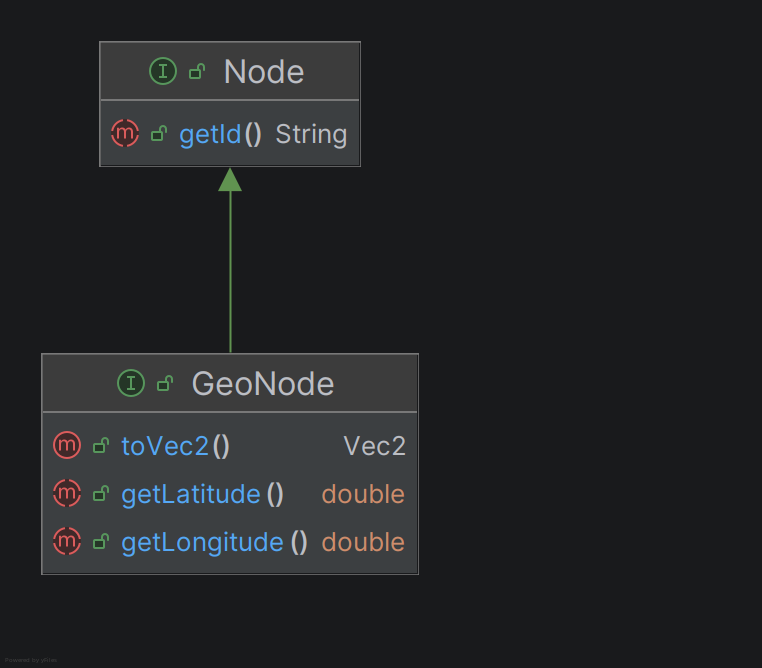
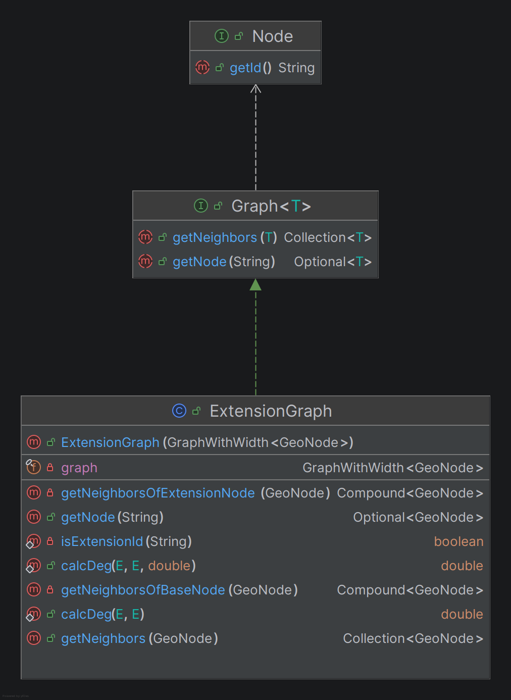

# Kapitel 2: Clean Architecture

## Was ist Clean Architecture?
Clean Architecture ist ein Software-Architekturmuster, das darauf abzielt, Software in Schichten zu unterteilen, um eine hohe Wartbarkeit, Testbarkeit und Unabhängigkeit von externen Frameworks oder Datenbanken zu erreichen. Das Kernprinzip ist die Trennung von Belangen (*Separation of Concerns*). Dabei werden Geschäftsregeln im Zentrum der Anwendung platziert, während technische Details wie Benutzeroberflächen, Datenbanken oder externe APIs in den äußeren Schichten angesiedelt sind. Eine wesentliche Eigenschaft ist, dass die inneren Schichten keine Kenntnis über die äußeren Schichten haben dürfen, was die Anwendung robust gegenüber technologischen Änderungen macht.

## Analyse der Dependency Rule
Die *Dependency Rule* besagt, dass Abhängigkeiten im Quellcode nur von außen nach innen zeigen dürfen. Das bedeutet, dass ein Element in einer inneren Schicht (z. B. eine Entity) niemals Informationen über ein Element in einer äußeren Schicht (z. B. einen Datenbanktreiber) besitzen darf.

### Positiv-Beispiel 1: Dependency Rule
Ein positives Beispiel für die Einhaltung der Dependency Rule findet sich im Zusammenspiel zwischen dem Modul `2-application` und `3-domain`.

*   **Klasse:** `de.dhbwka.navigation.pathfinding.AStarPathFinder` (Schicht: Application)
*   **Abhängigkeit:** Die Klasse `AStarPathFinder` implementiert das Interface `PathFinder` aus der Domain-Schicht (`3-domain`).
*   **Analyse:**
    *   **Abhängigkeit nach innen:** `AStarPathFinder` (äußere Schicht) kennt und nutzt `PathFinder` sowie `Node` (innere Schicht). Dies entspricht der Regel.
    *   **Rückrichtung:** Die Domain-Interfaces (`PathFinder`, `Node`) haben keinerlei Kenntnis von der konkreten Implementierung des A*-Algorithmus oder anderen Klassen aus der Application-Schicht.
*   **UML-Inhalt:**
    *   Interface `PathFinder<T extends Node>` (aus `3-domain`).
    *   Klasse `AStarPathFinder<T extends Node>` (aus `2-application`).
    *   Ein Realisierungs-Pfeil (gestrichelt mit geschlossener Spitze) von `AStarPathFinder` zu `PathFinder`.

### Negativ-Beispiel: Dependency Rule
Ein Negativ-Beispiel kann nicht geliefert werden, da die Schichten der Applikation in Gradle Module separiert sind.
In den `build.gradle` Dateien der Module ist deklariert, dass Abhängigkeiten nur von Außen nach innen vorgenommen werden dürfen.
Diese Vorgehensweise schließt die Existenz eines Negativ-Beispiels aus.
Aus diesem Grund wird nachfolgend ein zweites Positiv-Beispiel aufgeführt.

### Positiv-Beispiel 2: Dependency Rule

## Analyse der Schichten

### Schicht: Domain (Entities / Core)
*   **Klasse:** `de.dhbwka.navigation.graph.node.GeoNode`
*   **Aufgabe:** Definiert die grundlegenden Eigenschaften eines geografischen Knotens (Breitengrad, Längengrad) im Navigationssystem.
*   **Einordnung & Begründung:** Diese Klasse (bzw. dieses Interface) gehört zur Domain-Schicht (entspricht dem `3-domain` Modul). Sie kapselt eine fundamentale betriebliche Enterprise-Regel: Was macht einen Ort in unserem System aus? Sie ist völlig unabhängig von der Art der Datenspeicherung oder dem verwendeten Algorithmus.
*   **UML:**
    
    * Das Interface `GeoNode` ist an das Interface `Node` durch Vererbung gekoppelt.
    * Die Methoden `getLatitude` und `getLongitude` sind der Zentrale Bestandteil des Interfaces und dienen dem Zugriff auf die Koordinaten des repräsentierten Knoten.
    * Die Methode `toVec2` überführt die Koordinate des repräsentierten Knoten in die Darstellungsweise eines Vektors, welcher für mathematische Operationen auf der Position eines Knotens verwendet wird.

### Schicht: Application (Use Cases)
*   **Klasse:** `de.dhbwka.navigation.extension.ExtensionGraph`
*   **Aufgabe:** Implementiert die Logik für die "Transparente Erweiterung" des Graphen. Sie berechnet die Zusatzknoten und deren Nachbarschaftsbeziehungen basierend auf einem Basis-Graphen.
*   **Einordnung & Begründung:** `ExtensionGraph` gehört zur Application-Schicht (`2-application`). Sie arbeitet dabei als eine Verarbeitungsschicht von Daten. Dabei erwartete sie von der darüberliegenden schicht, einem `Graph` über die Schnittstellenmethode `getNeighbours` und `getNode` Daten eines Basisgraphs, verarbeitet diese Daten zur Dualgraph-Erweiterung. Und gibt Daten über die `getNeighbours` und `getNode` Methode an die nächste angrenzende Schicht weiter. Datenhaltung ist nicht die Aufgabe dieser Klasse. Mit dieser zentralen Rolle in der Datenverarbeitung der Applikation lässt sich erklären, dass die Klasse ein Bestandteil der Application-Schicht ist.
* Die einzige Verantwortlichkeit dieser Klasse ist das Ermitteln von Nachbarschaften im erweiterten Graphen.
*   **UML:**

    *   Die Klasse `ExtensionGraph` ist durch Vererbung an die Klasse `Graph` gekoppelt.
    *   Die Methode `getNeighbors` ist die nach außen sichtbare Schnittstelle in der Datenverarbeitungskette. Die Aufgabe der Methode ist das Delegieren der Nachbarschaftssuche an die Methoden `getNeighborsOfExtensionNode` und `getNeighbhorsOfBaseNode`.
    *   Die Methoden wie `getNeighborsOfExtensionNode` und `getNeighbhorsOfBaseNode` sind nach außen nicht sichtbar und Trennen die Logik der Nachbarschaftsfindung nach dem Single Responsibility Pattern in 2 mögliche Verarbeitungspfade auf, die durch diese 2 Methoden getrennt voneinander behandelt werden.
    * Die Methode `getNode` ist Teil der Nach außen sichtbaren Schnittstelle und verantwortet den Zugriff auf Knoten per Id.
    * Die darüber hinausgehenden statischen Methoden sind zur Kapselung von wiederkehrenden Daten Operationen in eine Methode als eigene Verantwortlichkeit verlagert. Sie sind nach außen sichtbar, um ein besseres abtesten der implementierten Logik zu ermöglichen.
