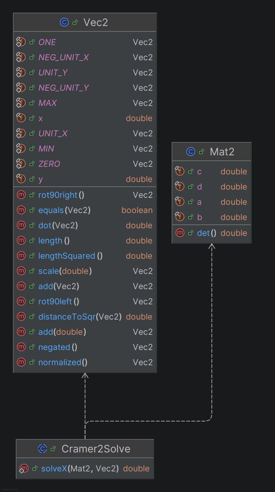
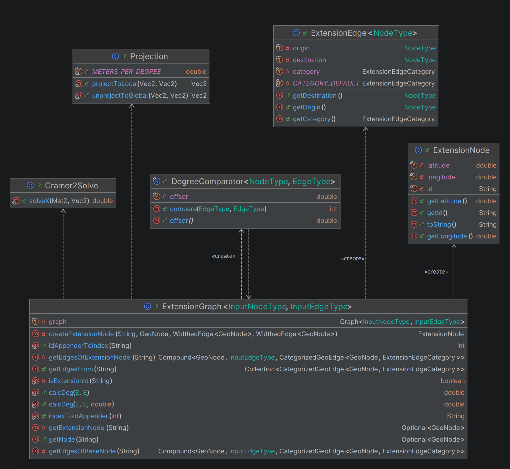
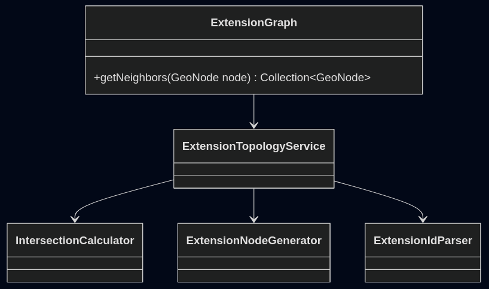
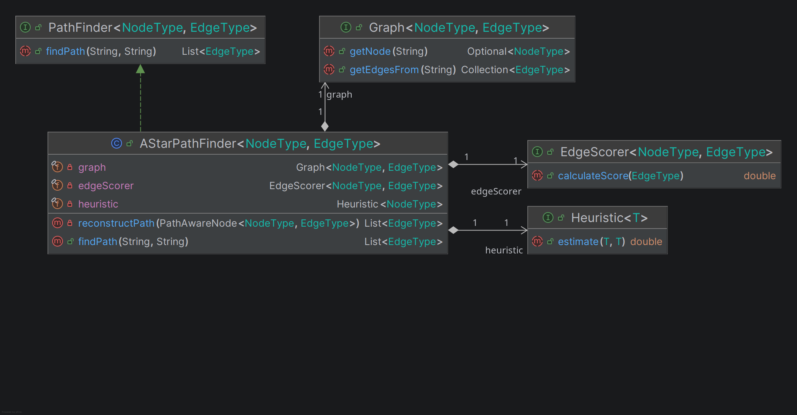
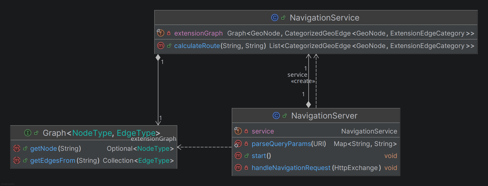
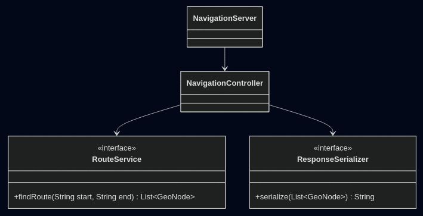
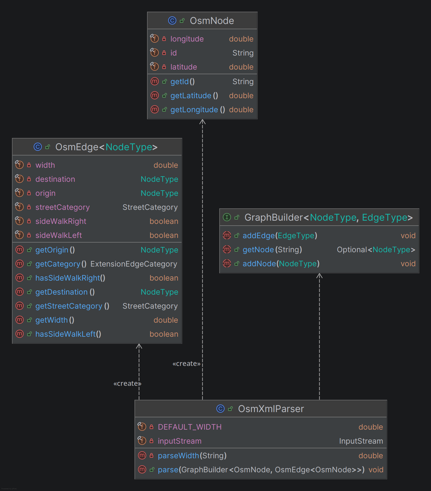
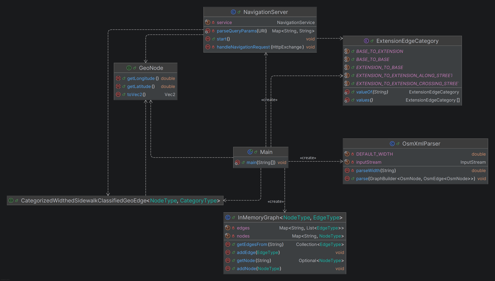
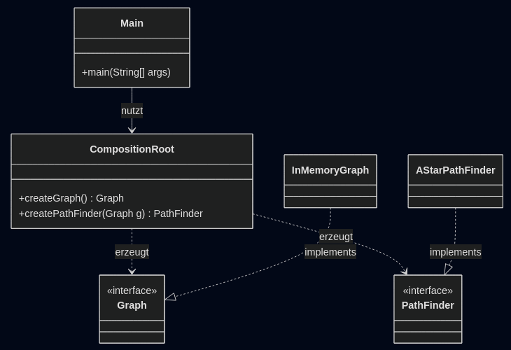

# Kapitel 3: SOLID

## Analyse Single-Responsibility-Principle (SRP)
<!--[jeweils eine Klasse als positives und negatives Beispiel für SRP; jeweils UML der Klasse und Beschreibung der Aufgabe bzw. der Aufgaben und möglicher Lösungsweg des Negativ-Beispiels (inkl. UML)]-->

### Positiv-Beispiel
<!--[Klasse, UML und Beschreibung]-->

**Klasse:** `Cramer2Solve` (`/3-domain/src/main/java/de/dhbwka/navigation/Cramer2Solve.java`)

**Aufgabe:**
Die Klasse hat genau eine Verantwortung: die Berechnung von `x` in einem linearen 2x2-Gleichungssystem mit der Cramer-Regel.

**Begründung:**
Die Klasse kapselt ausschließlich mathematische Lösungslogik und mischt keine Parser-, I/O- oder Domänenverantwortung hinein.

### Negativ-Beispiel
<!--[Klasse, UML, Aufgabenbeschreibung und Lösungsweg]-->

**Klasse:** `ExtensionGraph`

**Aufgaben (mehrere Verantwortlichkeiten):**
- Graph-Adapter (`Graph<GeoNode>`) für Nachbarschaften
- Berechnung geometrischer Projektionen und Schnittpunkte
- Erzeugung künstlicher Extension-Knoten
- Sortierung über Winkelberechnung und Nachbarschaftsordnung
- Parsing/Interpretation von Knoten-IDs (`isExtensionId`)

**Möglicher Lösungsweg:**
Verantwortlichkeiten aufteilen, z. B. in:
- `ExtensionTopologyService` (Topologie/Nachbarschaften)
- `IntersectionCalculator` (Geometrie/Schnittpunkte)
- `ExtensionNodeGenerator` (Erzeugung künstlicher Knoten)
- `ExtensionIdParser` (ID-Logik)

## Analyse Open-Closed-Principle (OCP)
[jeweils eine Klasse als positives und negatives Beispiel für OCP; jeweils UML der Klasse und Analyse mit Begründung, warum das OCP erfüllt/nicht erfüllt wurde – falls erfüllt: warum hier sinnvoll/welches Problem gab es? Falls nicht erfüllt: wie könnte man es lösen (inkl. UML)?]

### Positiv-Beispiel
<!--[Klasse, UML, Begründung und Sinnhaftigkeit]-->

**Klasse:** `AStarPathFinder`

**Begründung und Sinnhaftigkeit:**
Neue Bewertungslogiken (z. B. Zeitkosten, Straßentyp-Bewertung, Barrierefreiheit) können als neue `Scorer`-Implementierung ergänzt werden, ohne `AStarPathFinder` zu ändern. Das ist sinnvoll, weil die Route je nach Zielkriterium variieren soll, der Suchalgorithmus selbst aber stabil bleiben kann.

### Negativ-Beispiel
<!--[Klasse, UML, Analyse und Lösungsweg]-->

**Klasse:** `NavigationServer`

**Analyse:**
Die Klasse ist nicht gut für Erweiterungen geeignet, weil Protokoll-Details, Request-Parsing, Antwortformat und Routing-Aufruf eng gekoppelt sind.
Schon kleine neue Anforderungen (z. B. anderes Response-Format, weitere Endpunkte) erzwingen direkte Änderungen an derselben Klasse; z. B. würde ein zusätzliches strukturiertes JSON-Antwortschema direkt Anpassungen in `handleNavigationRequest` erfordern.

**Lösungsweg:**
HTTP-spezifische Verarbeitung, Anwendungslogik und Serialisierung trennen und über Schnittstellen erweiterbar machen.

## Analyse LSP / ISP / DIP
[jeweils eine Klasse als positives und negatives Beispiel für entweder LSP oder ISP oder DIP); jeweils UML der Klasse und Begründung, warum man hier das Prinzip erfüllt/nicht erfüllt wird]

### Positiv-Beispiel (DIP)
<!--[Klasse, UML und Begründung]-->
**Klasse:** `OsmXmlParser` 

**Begründung:**
`OsmXmlParser` hängt von der Abstraktion `GraphBuilder` ab statt von einer konkreten Implementierung wie `InMemoryGraph`.
Dadurch kann der Parser mit anderen Graph-Speicherstrategien wiederverwendet werden, ohne im Parser Änderungen zu erzwingen.

### Negativ-Beispiel (DIP)
<!--[Klasse, UML und Begründung]-->
**Klasse:** `Main`

**Begründung:**
`Main` ist direkt an mehrere konkrete Klassen gebunden und erzeugt diese selbst. Damit hängt ein High-Level-Ablauf stark von Low-Level-Details ab. Austausch oder Tests werden unnötig aufwendig.

**Mögliche Verbesserung:**
Ein Composition-Root mit Fabriken oder Konfiguration einführen, sodass `Main` nur gegen Abstraktionen arbeitet und die konkreten Implementierungen zentral verdrahtet werden.

