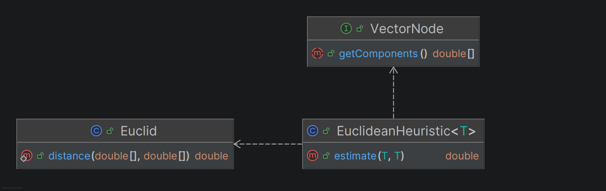
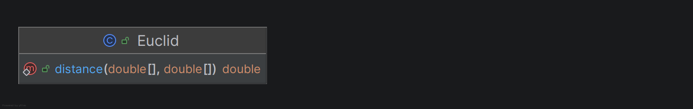

# Kapitel 4: Weitere Prinzipien

## Analyse GRASP: Geringe Kopplung
<!--[jeweils eine bis jetzt noch nicht behandelte Klasse als positives und negatives Beispiel geringer Kopplung; jeweils UML Diagramm mit zusammenspielenden Klassen, Aufgabenbeschreibung und Begründung für die Umsetzung der geringen Kopplung bzw. Beschreibung, wie die Kopplung aufgelöst werden kann]-->

### Positiv-Beispiel
<!--[Klasse, UML, Aufgabenbeschreibung und Begründung]-->

**Klasse:** `EuclideanHeuristic`

**Begründung:**  
- Die Klasse arbeitet ausschließlich mit dem Interface `VectorNode` und kennt von den Knoten nur deren Methode `getComponents()`).
- Sie ist unabhängig von der tatsächlichen konkreten Implementierung eines Knotenobjektes, solange es das Interface erfüllt.
- **Kopplung ist gering**, weil Änderungen an Knoten-Implementierungen ohne Änderung an der Heuristic möglich sind, solange das Interface stabil bleibt.

**Aufgabenbeschreibung:**  
Bestimmt die heuristische Distanz zwischen zwei beliebigen Knoten, ohne ihr konkretes Innenleben zu kennen.



### Negativ-Beispiel
<!--[Klasse, UML und Beschreibung der Auflösung]-->

#### Beschreibung der Vermeidung

Es konnte kein explizites Negativ-Beispiel für eine hohe Kopplung identifiziert werden.
Das Systemdesign folgt konsequent den Prinzipien der Clean Architecture und dem Prinzip „Programming to an Interface“.

* Ursache für hohe Kopplung: Eine Algorithmus-Klasse würde direkt von einer konkreten Knotensubklasse abhängen und hardcodiert auf deren spezifische Getter zugreifen. Jede Änderung an der Datenstruktur der Knoten würde dann den Algorithmus brechen.

* Architektonische Auflösung im Projekt: Diese potenzielle Fehlerquelle wurde bereits in der Designphase durch die strikte Einführung von Schnittstellen wie VectorNode und Edge, sowie dem Strategie-Muster wie EdgeScorer vollständig eliminiert. Da Abhängigkeiten im gesamten Projekt konsequent über Schnittstellen abstrahiert werden, existiert kein Fall enger Kopplung.

## Analyse GRASP: Hohe Kohäsion
<!--[eine Klasse als positives Beispiel hoher Kohäsion; UML Diagramm und Begründung, warum die Kohäsion hoch ist]-->
<!--[Klasse, UML und Begründung]-->

**Klasse:** `EuclideanUtils`

**Begründung:**  
- Die Klasse hat exakt eine Aufgabe: das Anbieten von Methoden zur Berechnung von euklidischen Distanzen.
- Alle Methoden und Felder dienen diesem Ziel.
- Es gibt keine Funktionen, die fachfremd wirken.
- **Sehr hohe Kohäsion**, da alles auf ein Ziel ausgerichtet ist und keine Vermischung anderer Verantwortlichkeiten vorliegt.

**Begründungstext:**  
Die Methode der Klasse rechnet die euklidische Distanz aus und dient zu keinem anderen Zweck.



## Don’t Repeat Yourself (DRY)
<!--[ein Commit angeben, bei dem duplizierter Code/duplizierte Logik aufgelöst wurde; Code-Beispiele (vorher/nachher); begründen und Auswirkung beschreiben]-->
<!--[Commit-ID, Code-Beispiele und Analyse]-->
**Commit:** [4192bdd](https://github.com/Transparente-OSM-Erweiterung/Navigation-Backend/commit/4192bddf6ca5b763d287cfbe778907a884e718c6)


### Code-Beispiele

#### Vorher

Die Berechnung des euklidischen Abstands war redundant in `EuclideanEdgeScorer` und `EuclideanHeuristic`  fest kodiert:

```java
// In EuclideanEdgeScorer und EuclideanHeuristic
double[] a = origin.getComponents();
double[] b = destination.getComponents();
if (a.length != b.length) throw new IllegalArgumentException("Dimension mismatch");

double sum = 0;
for (int i = 0; i < a.length; i++) {
    double d = a[i] - b[i];
    sum += d * d;
}
return Math.sqrt(sum);

```

#### Nachher

Die mathematische Logik wurde in eine separate Klasse `Euclid` ausgelagert. Die Klassen `EuclideanEdgeScorer` und `EuclideanHeuristic` rufen nun diese zentrale Methode auf:

```java
// Neue Klasse
package de.dhbwka.navigation.math;

public class Euclid {
    public static double distance(double[] a, double[] b) {
        if (a.length != b.length) throw new IllegalArgumentException("Dimension mismatch");
        double sum = 0;
        for (int i = 0; i < a.length; i++) {
            double d = a[i] - b[i];
            sum += d * d;
        }
        return Math.sqrt(sum);
    }
}

// Aufruf in EuclideanEdgeScorer & EuclideanHeuristic
return Euclid.distance(from.getComponents(), to.getComponents());

```

### Begründung und Auswirkung

* **Verstoß gegen das DRY-Prinzip:** Zuvor lag eine klassische Code-Duplikation vor. Mathematische Kern-Algorithmen sollten innerhalb einer Anwendung nie an mehreren Stellen unabhängig voneinander existieren.
* **Wartbarkeit und Fehleranfälligkeit:** Hätte sich an der Datenstruktur der Komponenten etwas geändert oder wäre ein mathematischer Optimierungsbedarf entstanden, hätte dieser Code an jeder einzelnen Stelle modifiziert werden müssen. Dies birgt das Risiko, Stellen zu vergessen und führt zu inkonsistentem Verhalten.
* **Auswirkung:** Durch das Refactoring wurde die Codebasis bereinigt, die Lesbarkeit in den Klassen `EuclideanEdgeScorer` und `EuclideanHeuristic` deutlich erhöht und die Berechnungslogik an einem Single Point of Truth isoliert. Anpassungen oder Optimierungen der Abstandsmetrik können nun zentral und ohne Seiteneffekte an einer einzigen Stelle durchgeführt werden.
