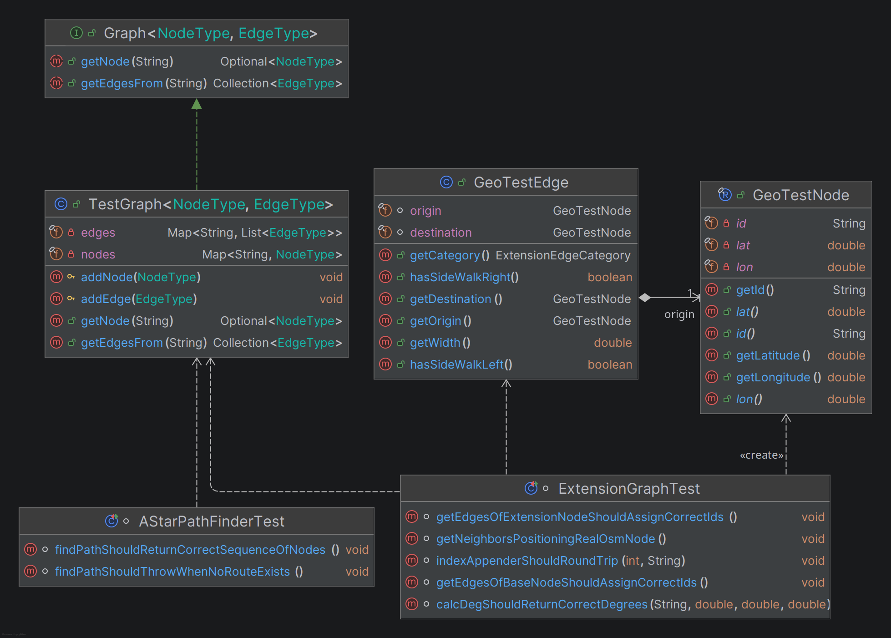
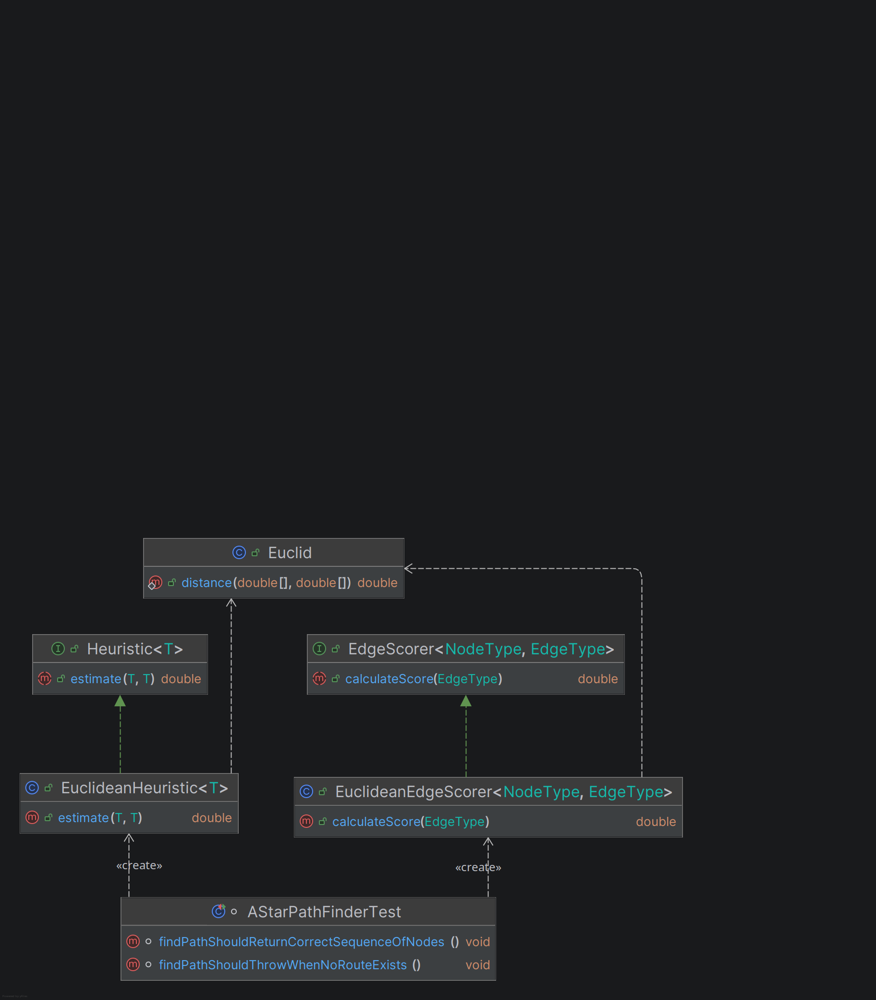

# Kapitel 5: Unit Tests

## 10 Unit Tests
Die Tests fokussieren zentrale Domänenlogik: Pfadfindung, Graph-Erweiterung, Filterung und Projektion.

| Unit Test (Klasse#Methode)                                                            | Beschreibung                                                          |
|:--------------------------------------------------------------------------------------|:----------------------------------------------------------------------|
| 1. `AStarPathFinderTest#findPathShouldReturnCorrectSequenceOfNodes`                   | A* wählt den erwarteten Pfad (A->B->D) im Beispielgraphen.            |
| 2. `AStarPathFinderTest#findPathShouldThrowWhenNoRouteExists`                         | exestiert kein Pfad soll eine definierte Exception geschmissen weden. |
| 3. `ExtensionGraphTest#getEdgesOfBaseNodeShouldAssignCorrectIds`                      | Basisknoten erhält korrekt benannte Extension-Edges (a,b,c,d).        |
| 4. `ExtensionGraphTest#getEdgesOfExtensionNodeShouldAssignCorrectIds`                 | Extension-Knoten liefert Base- und Extension-Nodes korrekt.           |
| 5. `ExtensionGraphTest#getNeighborsPositioningRealOsmNode`                            | Nachbarschaften für reale OSM-Koordinaten werden korrekt erzeugt.     |
| 6. `ExtensionGraphTest#calcDegShouldReturnCorrectDegrees`                             | Winkelberechnung liefert korrekte Gradwerte für alle Quadranten.      |
| 7. `ExtensionGraphTest#indexAppenderShouldRoundTrip`                                  | Index zu Appender-Mapping ist beidseitig konsistent.                  |
| 8. `FilteredGraphTest#getEdgesFromShouldFilterByPredicate`                            | FilteredGraph entfernt Kanten anhand eines Prädikats.                 |
| 9. `ExtensionEdgeCategoryPredicateTest#shouldAllowEdgesByStartDestinationAndCategory` | Filterlogik erlaubt Base Edges von Start- und Zielknoten.             |
| 10. `ProjectionTest#projectUnprojectShouldRoundTrip`                                  | Projektion und Rückprojektion sind numerisch stabil.                  |

## ATRIP: Automatic
Die Tests laufen automatisch mit JUnit 5 über Gradle (`./gradlew test`) und benötigen keine manuelle Eingabe.
Bei jedem `./gradlew build` werden ebengalls alle Unittests durchlaufen und der Build schlägt bei Testfehlern fehl. 
Alle Testdaten werden im Testcode mithilfe der Klassen `TestGraph` und `TestGraphBuilder` aufgebaut, wodurch die Tests reproduzierbar und deterministisch bleiben.

## ATRIP: Thorough
<!--[jeweils 1 positives und negatives Beispiel zu ‘Thorough’; jeweils Code-Beispiel, Analyse und Begründung, was professionell/nicht professionell ist]-->

### Positiv-Beispiel: Thorough
```java
@ParameterizedTest(name = "Angle of Node {0} ({1}|{2}) should be {3}°")
@CsvSource({
        "1,  0,  1,   0",
        "2,  1,  1,  45",
        "3,  1,  0,  90",
        "4,  1, -1, 135",
        "5,  0, -1, 180",
        "6, -1, -1, 225",
        "7, -1,  0, 270",
        "8, -1,  1, 315"
})
void calcDegShouldReturnCorrectDegrees(String id, double x, double y, double expectedDeg) {
    GeoTestNode origin = new GeoTestNode("0", 0, 0);
    GeoTestNode target = new GeoTestNode(id, x, y);

    assertThat(ExtensionGraph.calcDeg(origin, target))
        .as("Calculated angle for node %s", id)
        .isEqualTo(expectedDeg);
}
```
**Analyse:** Mehrere repräsentative Fälle (alle Quadranten) werden systematisch getestet. Dadurch ist die Wahrscheinlichkeit hoch, dass Regressionsfehler in der Winkelberechnung erkannt werden.

### Negativ-Beispiel: Thorough
```java
@Test
void projectUnprojectShouldRoundTrip() {
    Vec2 reference = new Vec2(49.0, 8.4);
    Vec2 global = new Vec2(49.0001, 8.4002);

    Vec2 local = Projection.projectToLocal(global, reference);
    Vec2 result = Projection.unprojectToGlobal(local, reference);

    assertThat(result.x).isCloseTo(global.x, within(1e-9));
    assertThat(result.y).isCloseTo(global.y, within(1e-9));
}
```
**Analyse:** Der Test nutzt nur ein einziges Koordinatenpaar. Damit bleibt offen, wie die Projektion bei anderen Distanzen oder Richtungen reagiert. Für „Thorough“ wären mehrere Eingaben oder größere Offsets nötig.


## ATRIP: Professional
<!--[jeweils 1 positives und negatives Beispiel zu ‘Professional’; jeweils Code-Beispiel, Analyse und Begründung, was professionell/nicht professionell ist]-->

### Positiv-Beispiel: Professional
```java
@Test
void getEdgesFromShouldFilterByPredicate() {
    // Arrange
    TestGraph<Vector2Node, Vector2Edge> graph = TestGraphBuilder.<Vector2Node, Vector2Edge>create()
            .nodes(
                    new Vector2Node("A", 0, 0),
                    new Vector2Node("B", 1, 0),
                    new Vector2Node("C", 0, 1)
            )
            .connect("A", "B", Vector2Edge::new)
            .connect("A", "C", Vector2Edge::new)
            .build();

    FilteredGraph<Vector2Node, Vector2Edge> filteredGraph = new FilteredGraph<>(
            graph,
            edge -> edge.getDestination().getId().equals("B")
    );

    // Act + Assert
    assertThat(filteredGraph.getEdgesFrom("A"))
            .extracting(edge -> edge.getDestination().getId())
            .containsExactly("B");
}
```
**Analyse:** Klare Arrange/Act/Assert-Struktur, sprechender Testname und eindeutige Assertions machen den Test leicht verständlich und wartbar.

### Negativ-Beispiel: Professional
```java
@Test
void shouldAllowEdgesByStartDestinationAndCategory() {
    ExtensionEdgeCategoryPredicate<TestNode, TestEdge> predicate =
            new ExtensionEdgeCategoryPredicate<>("start", "dest");

    TestNode start = new TestNode("start");
    TestNode dest = new TestNode("dest");
    TestNode other = new TestNode("other");

    assertThat(predicate.test(new TestEdge(start, other, ExtensionEdgeCategory.BASE_TO_BASE)))
            .isTrue();
    assertThat(predicate.test(new TestEdge(other, dest, ExtensionEdgeCategory.BASE_TO_BASE)))
            .isTrue();
    assertThat(predicate.test(new TestEdge(other, other, ExtensionEdgeCategory.EXTENSION_TO_EXTENSION_ALONG_STREET)))
            .isTrue();
    assertThat(predicate.test(new TestEdge(other, other, ExtensionEdgeCategory.BASE_TO_BASE)))
            .isFalse();
}
```
**Analyse:** Vier unterschiedliche Fälle werden in einem Test zusammengefasst. Das erschwert die Fehlersuche, weil nicht sofort klar ist, welcher Fall genau fehlschlägt. Professioneller wäre eine Parametrisierung oder getrennte Tests pro Fall.


## Code Coverage
Aktuell liegt der Schwerpunkt der Tests im Modul **3-domain**. Damit sind Pfadfindung, Graph-Erweiterung und Filterlogik gut abgedeckt. Nicht abgedeckt sind u. a. Adapter/Server-Schichten, OSM-Parsing sowie Integrationslogik in `0-plugin` und `1-adapters`. Für höhere Coverage sollten dort zusätzliche Unit- und Integrationstests ergänzt werden.

## Fakes und Mocks
Im Projekt werden primär **Fakes** eingesetzt, da keine externen Systeme eingebunden werden müssen und das Verhalten vollständig im Test kontrolliert werden kann.

**Fake 1: TestGraph** (ersetzt ein reales Graph-Repository, um Pfadfindung deterministisch zu testen)



**Fake 2: EuclideanHeuristic und EuclideanEdgeScorer** ersetzen die produktive Implementierung der geographischen Haversine Heuristic und des EdgeScorers. Dieser Fake separiert die Haversine Berechnungslogik, sodass anhand einer einfachen stabilen euklidschen Distanz Implementierung Tests Fehlschläge aussagekräftig sind. Etwa kann ein Fehler in der Haversine Berechnung nicht die Path Finder Tests zum scheitern bringen, sondern lediglich tatsächliche Mängel in der Pathfinding Logik.


