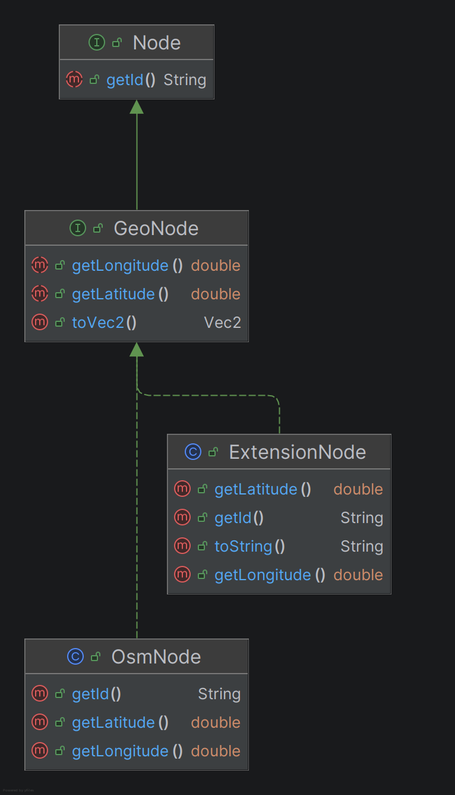
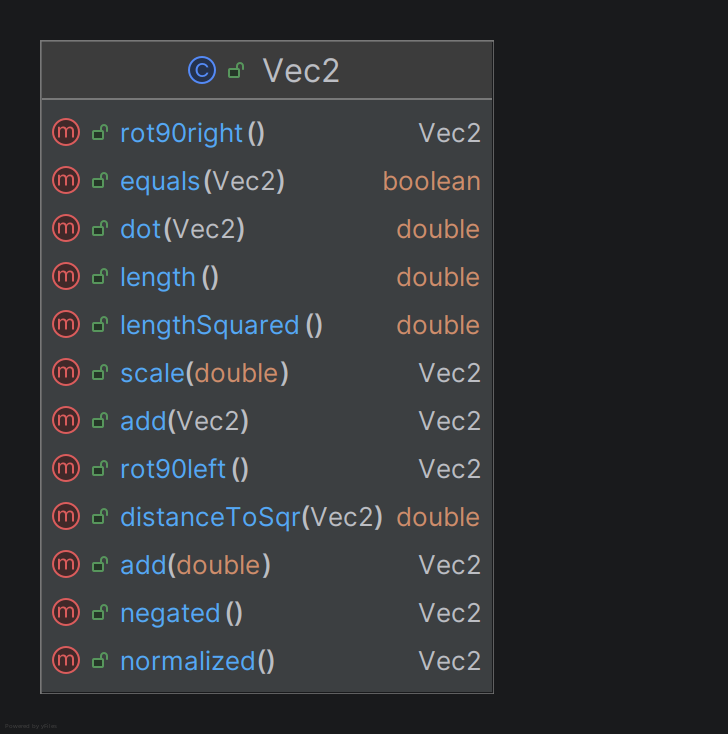

# Kapitel 6: Domain Driven Design

## Ubiquitous Language
[4 Beispiele für die Ubiquitous Language; jeweils Bezeichnung, Bedeutung und kurze Begründung, warum es zur Ubiquitous Language gehört]

| Bezeichnung                | Bedeutung                                                                                                           | Begründung                                                                                                                                                                                                                                                                                                                                      |
|:---------------------------|:--------------------------------------------------------------------------------------------------------------------|:------------------------------------------------------------------------------------------------------------------------------------------------------------------------------------------------------------------------------------------------------------------------------------------------------------------------------------------------|
| 1. Extension Node          | Ein vom Extension Graph erzeugter Fuß- oder Radwegknoten                                                            | Der Begriff schafft eine eindeutige Abgrenzung zu Nodes des Ursprungsgraphen und verhindert, dass im Team unterschiedliche Begriffe wie Vertex oder Extra Node durcheinander genutzt werden. Damit ist Extension Node ein bewusst festgelegter Begriff, der konsistent in Code, Architektur und fachlicher Kommunikation verwendet werden kann. |
| 2. Extension Edge          | Eine vom Extension Graph erzeugte Kante, welche eine Extension Node mit einer anderen Node verbindet                | Extension Edge ist Teil der Ubiquitous Language, weil damit klar geregelt ist, welche Kanten zur Erweiterungslogik gehören und welche zum Ursprungsgraphen. Das reduziert Missverständnisse in Algorithmen und Tests und sorgt für stabile, wiedererkennbare Benennung in Klassen, Methoden und Datenstrukturen.                                |
| 3. Extension Graph         | Ein Graph, welcher Extension Nodes und Extension Edges zusätzlich zu Nodes und Edges eines Ursprungsgraphen erzeugt | Der Begriff dient zur fachlichen Trennung in zwei Ebenen. Der Extension Graph als Transparente Erweiterung und der Basis Graph als OSM-Graph-Struktur. Ohne diese feste Trennung würden schnell Inkonsistenzen in der Kommunikation und Code-Struktur entstehen.                                                                                |
| 4. Extension Edge Category | Eine Klassifizierung der Extension Edge, bezüglich der Arten an Knoten, welche die Kante verbindet                  | Die Klassifizierung der Kanten bildet die Basis für Regeln welche basierend auf der Kanten Klassifizierung Fehlerbehebungen im erweiterten Graphen durchführen. Die Definition des Begriffs erlaubt eine präzise Ausdrucksweise – sowohl im Gespräch als auch in der Logik im Produktiv-Code und in Tests.                                      |

## Entities
[UML, Beschreibung und Begründung des Einsatzes einer Entity; falls keine Entity vorhanden: ausführliche Begründung, warum es keines geben kann/hier nicht sinnvoll ist]

Eine Entity zeichnet sich im Domain-Driven Design dadurch aus, dass sie eine eindeutige, über die Zeit und Zustände hinweg stabile Identität besitzt.
Ihre Identifizierbarkeit basiert nicht auf der Gleichheit ihrer Attribute, sondern auf einem permanenten Identifikationsmerkmal.
Im Projekt bildet das Interface `GeoNode`, sowie dessen konkrete Implementierungen `OsmNode` und `ExtensionNode` die eine zentrale Entität der Domäne.
Jede `GeoNode` besitzt über das Basis-Interface `Node` eine eindeutige Kennung, welche über die Methode `getId()` abgefragt werden kann.

### Fachliche Begründung:
Innerhalb eines Navigationsnetzwerks ist die Identität eines Knotens von fundamentaler Bedeutung.
Zwei Knoten sind selbst dann nicht identisch, wenn sie exakt dieselben geografischen Koordinaten aufweisen, beispielsweise bei übereinanderliegenden Verkehrsebenen oder eng beieinanderliegenden Spuraufteilungen an Kreuzungen.
Umgekehrt bleibt ein Knoten fachlich dieselbe Kreuzung, selbst wenn sich seine Koordinaten durch präzisere Messungen minimal verschieben würden.
Der Routing-Algorithmus `AStarPathFinder` stützt sich maßgeblich auf diese ID-Stabilität, um besuchte Knoten in Datenstrukturen zu verwalten, Pfade fehlerfrei zu rekonstruieren und Nachbarschaftsbeziehungen eindeutig aufzulösen.

## Value Objects
[UML, Beschreibung und Begründung des Einsatzes eines Value Objects; falls kein Value Object vorhanden: ausführliche Begründung, warum es keines geben kann/hier nicht sinnvoll ist]

in Value Object besitzt im DDD-Kontext keine eigene konzeptionelle Identität.
Es wird ausschließlich durch die Gesamtheit seiner Attribute definiert.
Zwei Wertobjekte gelten als absolut gleich und austauschbar, wenn all ihre Attribute übereinstimmen.
Zudem sind Value Objects immutabel.
Zustandsänderungen führen immer zur Erzeugung einer neuen Instanz.

Die Klasse `Vec2` im Abstraktionsmodul ist ein Value Object.
Sie kapselt ein zweidimensionales Koordinatenpaar (`x`, `y`) für mathematische Berechnungen im euklidischen Raum.
Alle Methoden wie `scale()`, `add()`, `normalized()`, `negated()` oder `rot90right()` modifizieren nicht den internen Zustand des Objekts, sondern geben frisch instanziierte `Vec2`-Objekt zurück.

### Fachliche Begründung:
Bei der Berechnung der Transparenten Erweiterung des Graphen im `ExtensionGraph` müssen geometrische Operationen durchgeführt werden.
Für diese mathematischen Operationen ist es völlig irrelevant, welche spezifische Objektinstanz vorliegt.
Es zählt ausschließlich der numerische Wert des Vektors.
Die erzwungene Unveränderlichkeit schützt die Kernlogik vor schwer auffindbaren Seiteneffekten, da ein einmal berechneter Vektor nicht unabsichtlich an einer anderen Stelle der Anwendung manipuliert werden kann.

## Repositories
[UML, Beschreibung und Begründung des Einsatzes eines Repositories; falls kein Repository vorhanden: ausführliche Begründung, warum es keines geben kann/hier nicht sinnvoll ist]

Ein klassisches DDD-Repository dient dazu, den Zugriff auf persistente Speicherstrukturen, wie etwa relationale Datenbanken zu kapseln.
Es vermittelt der Domänenschicht die Illusion einer einfachen In-Memory-Kollektion von Aggregaten und stellt Methoden für die CRUD-Operationen bereit.
Im vorliegenden Navigationssystem existiert kein dediziertes Repository-Muster nach strenger DDD-Definition, da sein Einsatz aus den folgenden Gründen architektonisch nicht sinnvoll wäre:

1. **Reine Read-Only-Natur des Domänenbetriebs:** Das Navigations-Backend modifiziert oder persistiert im regulären Betrieb keine Daten. Die zugrundeliegenden Kartendaten stammen aus einer statischen XML-Datei (`map.osm`), die einmalig beim Anwendungsstart über den `OsmXmlParser` eingelesen und vollständig verarbeitet wird. Es gibt keine persistenten Datenänderungen zur Laufzeit, weshalb ein Repository überflüssig ist.
2. **Die Graphen-Struktur als native In-Memory-Kollektion:** Die Klasse `InMemoryGraph` verwaltet alle Knoten und Kanten direkt innerhalb von Java-Standardkollektionen (`HashMap`) im Hauptspeicher. Das Domänen-Interface `Graph` abstrahiert diesen Datenzugriff bereits auf ein Minimum, indem es lediglich Abfragemethoden für Knoten (`getNode`) und deren Nachbarschaften (`getEdgesFrom`) zur Verfügung stellt.

Die Einführung eines zusätzlichen Repositories, welches das `Graph`-Interface lediglich umschließen würde, würde zu unnötiger Komplexität führen, da die Funktionalität des Datenabrufs bereits vollständig und sauber durch die Graphen-Abstraktion abgedeckt ist.

## Aggregates
[UML, Beschreibung und Begründung des Einsatzes eines Aggregates; falls kein Aggregate vorhanden: ausführliche Begründung, warum es keines geben kann/hier nicht sinnvoll ist]

Ein Aggregate fasst eine Menge von Entitäten und Wertobjekten zusammen, die als logische Einheit für Datenänderungen betrachtet werden.
Es definiert eine strikte Konsistenzgrenze, innerhalb derer geschäftliche Invarianten unter der Kontrolle einer führenden Wurzelentität (Aggregate Root) erzwungen werden.
Ein direkter Zugriff von außen ist nur auf die Wurzel erlaubt.
Im Design dieses Navigationssystems wurde bewusst auf Aggregat-Strukturen verzichtet:

1. **Fehlen von transienten Zustandsänderungen und Invarianten-Schutz:** Aggregate entfalten ihre primäre Stärke beim Validieren von Zustandsübergängen im Zuge von Schreiboperationen. Da dieses Navigationssystem nach dem initialen Parsing-Schritt vollkommen zustandslos und rein lesend arbeitet, müssen zu keinem Zeitpunkt geschäftliche Invarianten bei der Manipulation einzelner Knoten geschützt werden.
2. **Globale Verflechtung der Netzwerktopologie:** In einem Navigationsgraphen stehen alle Entitäten über ein dichtes Geflecht aus Kanten miteinander in Beziehung.
3. Es existiert keine hierarchische Baumstruktur, in der ein bestimmter Knoten die klare Hoheit über andere Knoten besitzt. Würde man versuchen, ein Aggregat zu erzwingen, müsste der gesamte Graph als ein einziges, riesiges Aggregat definiert werden, da eine Änderung an einer Kante potenziell die globale Erreichbarkeit im gesamten Netzwerk beeinflusst. Solch riesige Aggregate verletzen jedoch die DDD-Designrichtlinien, da sie Speicher- und Performance-Probleme verursachen.
