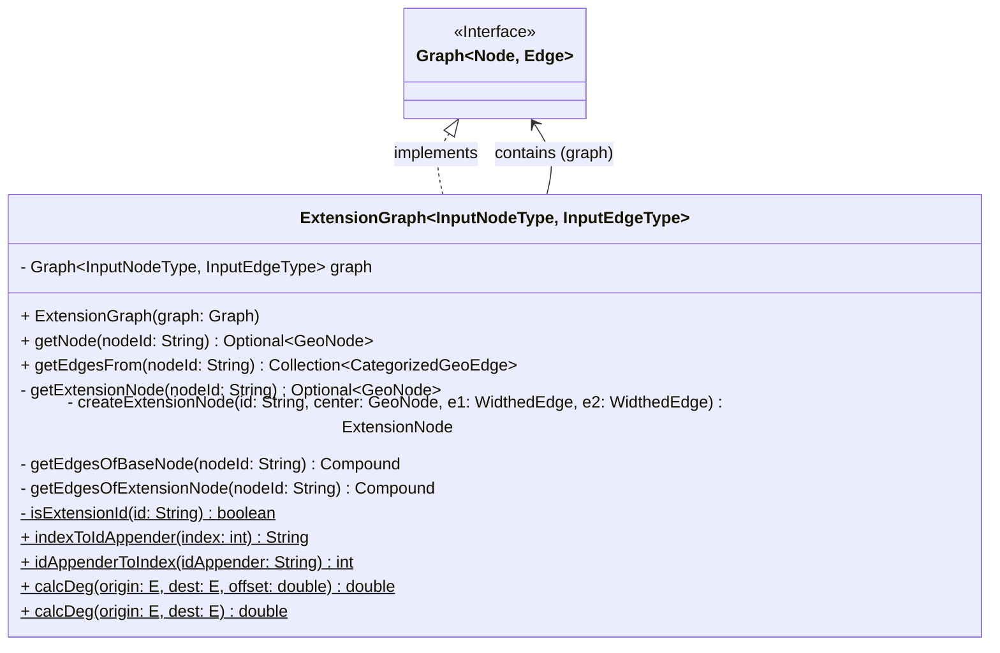
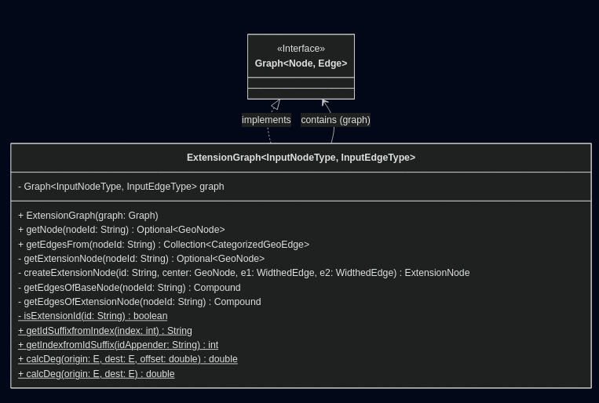
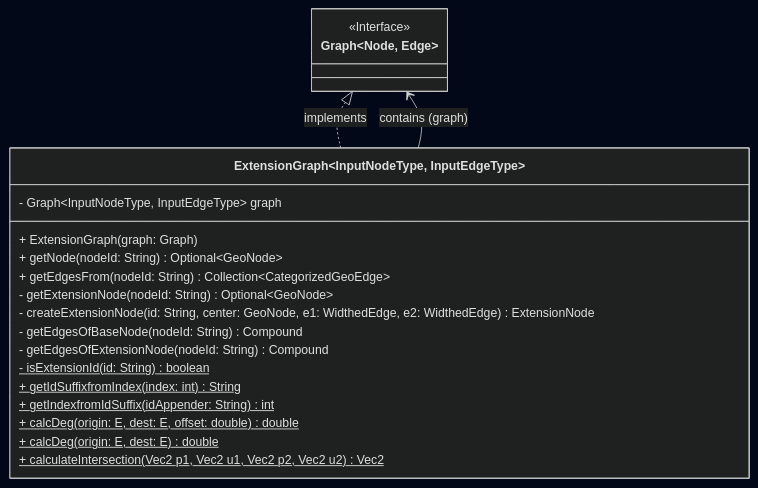
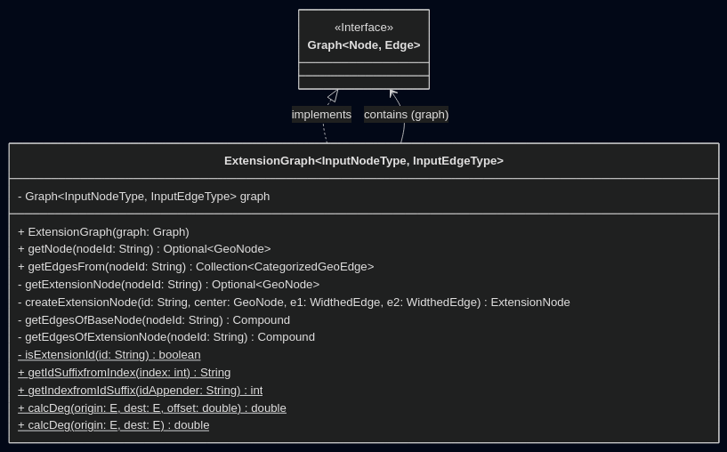
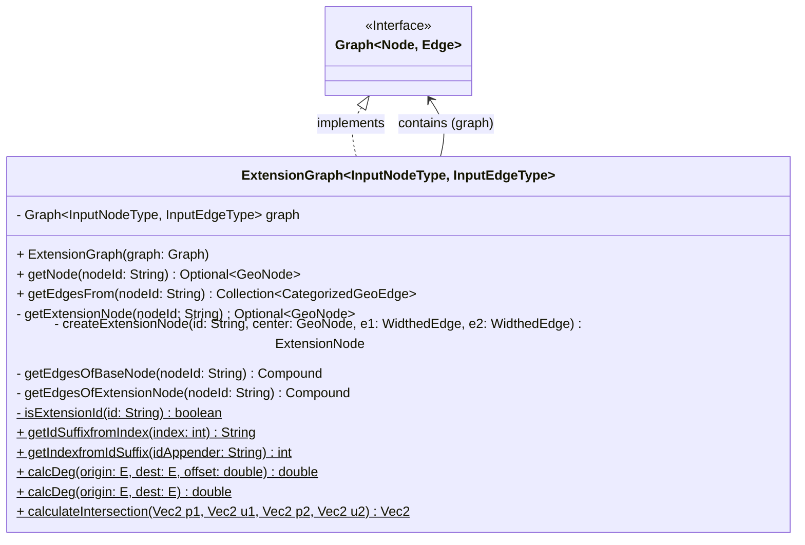
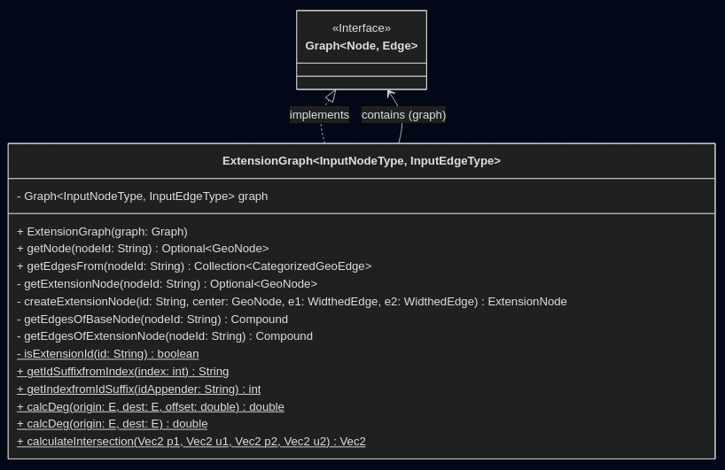

# Kapitel 7: Refactoring

## Code Smells
<!--[jeweils 1 Code-Beispiel zu 2 Code Smells aus der Vorlesung; jeweils Code-Beispiel und einen möglichen Lösungsweg bzw. den genommen Lösungsweg beschreiben (inkl. (Pseudo-)Code)]-->

### Code Smell 1: Duplicated Code
<!--[Code-Beispiel und Lösungsweg]-->

Derzeit wird redundanter Code innerhalb des Projekts verwendet, um die euklidische Distanz zwischen zwei Punkten zu berechnen. Code Duplication beschreibt die mehrfache Verwendung der identischen Logik an verschiedenen Stellen, was die Wartbarkeit erschwert wodurch Änderungen an mehreren Stellen nachgepflegt werden müssen.

In diesem Projekt tritt dies in den Klassen `EuclideanEdgeScorer` und `EuclideanHeuristic` auf. Beide implementieren die folgende Logik zur Distanzberechnung:

`EuclideanEdgeScorer`
```java
public double calculateScore(EdgeType edge) {
        NodeType origin = edge.getOrigin();
        NodeType destination = edge.getDestination();
        double[] a = origin.getComponents();
        double[] b = destination.getComponents();
        if (a.length != b.length) throw new IllegalArgumentException("Dimension mismatch");

        double sum = 0;
        for (int i = 0; i < a.length; i++) {
            double d = a[i] - b[i];
            sum += d * d;
        }
        return Math.sqrt(sum);
        return Euclid.distance(edge.getOrigin().getComponents(), edge.getDestination().getComponents());
    }
```

`EuclideanHeuristic`
```java
public double estimate(T from, T to) {
        double[] a = from.getComponents();
        double[] b = to.getComponents();

        if (a.length != b.length) throw new IllegalArgumentException("Dimension mismatch");

        double sum = 0;
        for (int i = 0; i < a.length; i++) {
            double d = a[i] - b[i];
            sum += d * d;
        }
        return Math.sqrt(sum);
        return Euclid.distance(from.getComponents(), to.getComponents());
    }
```

Um dieses Problem zu lösen und den Code Smell zu beseitigen, könnte die Logik zur Berechnung der euklidischen Distanz in eine separate Hilfsklasse oder Methode ausgelagert werden. Deshalb kann eine Utility-Klasse namens `Euclid` erstellt werden, die eine statische Methode `distance` enthält:

```java
public class Euclid {
    public static double distance(double[] a, double[] b) {
        if (a.length != b.length)
            throw new IllegalArgumentException("Dimension mismatch");
        double sum = 0;
        for (int i = 0; i < a.length; i++) {
            double d = a[i] - b[i];
            sum += d * d;
        }
        return Math.sqrt(sum);
    }
}
```  

Anschließend kann nun diese Methode in beiden Klassen verwendet werden, um die euklidische Distanz zu berechnen, wodurch der redundante Code entfernt wird. Wenn man nun die Berechnung verändern möchte muss nur die Klasse `Euclid` angepasst werden, wodurch die Wartbarkeit verbessert wird.


### Code Smell 2: Long Method
<!--[Code-Beispiel und Lösungsweg]-->

Der zweite Code Smell, der in diesem Projekt auftritt, ist die Existenz von langen Methoden. Long Methods erschweren die Lesbarkeit da längere zusammenhängende Code-Blöcke, schwerer zu verstehen sind. In diesem Projekt tritt dieser Code Smell insbesondere in der Klasse `ExtensionGraph` auf. In der Klasse `ExtensionGraph` gibt es die Methode `getNeighborsOfBaseNode`, die eine beträchtliche Anzahl von Zeilen umfasst und derzeit zu viele unterschiedliche Aufgabenbereiche übernimmt.

```java
@Deprecated
    private Compound<GeoNode> getNeighborsOfBaseNode(GeoNode node) {
        if(isExtensionId(node.getId())) throw new IllegalArgumentException();
        Compound<GeoNode> compound = new Compound<>(new ArrayList<>(), new ArrayList<>());
        compound.baseNodes.addAll(graph.getEdgesFrom(node.getId()).stream().map(GeoEdge::getDestination).toList());
        compound.baseNodes.sort(new DegreeComparator<>(node, 0));

        Vec2 projectionReference = node.toVec2();
        Vec2 localOrigin = Projection.projectToLocal(projectionReference, projectionReference);

        for (int i = 0; i < compound.baseNodes.size(); i++) {
            Vec2 localNeighbor1 = Projection.projectToLocal(
                    compound.baseNodes.get(i).toVec2(),
                    projectionReference
            );
            Vec2 localNeighbor2 = Projection.projectToLocal(
                    compound.baseNodes.get((i + 1) % compound.baseNodes.size()).toVec2(),
                    projectionReference
            );

            Vec2 u1 = localNeighbor1.add(localOrigin.negated()).normalized();
            Vec2 u2 = localNeighbor2.add(localOrigin.negated()).normalized();

            Vec2 normal1 = u1.rot90right();
            Vec2 normal2 = u2.rot90left();

            Vec2 p1 = localOrigin.add(normal1.scale(
                    0.5 * graph.getWidth(
                            node.getId(),
                            compound.baseNodes.get(i).getId()
                    )
            ));
            Vec2 p2 = localOrigin.add(normal2.scale(
                    0.5 * graph.getWidth(
                            node.getId(),
                            compound.baseNodes.get((i + 1) % compound.baseNodes.size()).getId()
                    )
            ));

            // g: point1 + u1 * s
            // f: point2 + u2 * t

            //(u1.x, -u2.x) * (s) = (p2.x - p1.x)
            //(u1.y, -u2.y)   (t)   (p2.y - p1.y)

            Mat2 mat = new Mat2(
                    u1.x, -u2.x,
                    u1.y, -u2.y
            );
            Vec2 rhs = p2.add(p1.negated());

            Vec2 localIntersection;
            try {
                double s = Cramer2Solve.solveX(mat, rhs);
                localIntersection = p1.add(u1.scale(s));
            } catch (IllegalArgumentException e) {
                localIntersection = p1.add(p2).scale(0.5);
            }

            Vec2 globalIntersection = Projection.unprojectToGlobal(localIntersection, projectionReference);

            compound.extenesionNodes.add(new ExtensionNode(
                    node.getId() + indexToIdAppender(i),
                    globalIntersection.x,
                    globalIntersection.y)
            );
        }

        if(!compound.baseNodes.isEmpty()) {
            compound.extenesionNodes.sort(new DegreeComparator<>(node, calcDeg(node, compound.baseNodes.getFirst())));
        }
        return compound;
    }
```
Wie man sehen kann erfüllt die Methode `getNeighborsOfBaseNode` mehrere Verantwortlichkeiten, wie das Abrufen der Nachbarn, die Erstellung von Vectoren zu den Nachbarn, die Berechnung der Normalen und Parallelen für die Schnittpunktbildung und die Erstellung von Erweiterungsknoten. Dies macht es schwierig, den Überblick über die Methode zu behalten und die Methode zu warten. Deshalb bietet es sich an, die Aufgabenbereiche der `getNeighborsOfBaseNode` Methode in mehrere kleinere Methoden auszulagern, die jeweils einen klar definierten Aufgabenbereich haben. Zum Beispiel könnte man die Initialisierung des `Compound`-Objekts in eine separate Methode namens `initializeCompound` auslagern.

```java
private Compound<GeoNode> initializeCompound(GeoNode node) {
        Compound<GeoNode> compound = new Compound<>(new ArrayList<>(), new ArrayList<>());
        compound.baseNodes.addAll(graph.getEdgesFrom(node.getId()).stream().map(GeoEdge::getDestination).toList());
        compound.baseNodes.sort(new DegreeComparator<>(node, 0));
        return compound;
    }
```

 die Berechnung des Schnittpunkts in eine Methode namens `calculateLocalIntersection`. 
 ```java
private Vec2 calculateLocalIntersection(GeoNode node, GeoNode neighborA, GeoNode neighborB, 
                                        Vec2 localOrigin, Vec2 projectionReference) {
    
    Vec2 localA = Projection.projectToLocal(neighborA.toVec2(), projectionReference);
    Vec2 localB = Projection.projectToLocal(neighborB.toVec2(), projectionReference);

    Vec2 u1 = localA.add(localOrigin.negated()).normalized();
    Vec2 u2 = localB.add(localOrigin.negated()).normalized();

    Vec2 p1 = localOrigin.add(u1.rot90right().scale(0.5 * graph.getWidth(node.getId(), neighborA.getId())));
    Vec2 p2 = localOrigin.add(u2.rot90left().scale(0.5 * graph.getWidth(node.getId(), neighborB.getId())));

    return solveIntersection(p1, p2, u1, u2);
}
```

Und die Erstellung der Erweiterungsknoten könnte zusätzlich in eine separate Methode namens `addExtensionNode` ausgelagert werden.

```java
private void addExtensionNode(Compound<GeoNode> compound, GeoNode baseNode, 
                              Vec2 localIntersection, Vec2 projectionReference, int index) {
    
    Vec2 globalIntersection = Projection.unprojectToGlobal(localIntersection, projectionReference);
    compound.extenesionNodes.add(new ExtensionNode(
            baseNode.getId() + indexToIdAppender(index),
            globalIntersection.x,
            globalIntersection.y
    ));
}
```

Dadurch wird die Hauptmethode `getNeighborsOfBaseNode` übersichtlicher und leichter verständlich, da sie sich nun auf die Koordination der verschiedenen Schritte konzentriert, anstatt alle Details zu enthalten.
## 2 Refactorings
<!--[2 unterschiedliche Refactorings aus der Vorlesung anwenden, begründen, sowie UML vorher/nachher liefern; jeweils auf die Commits verweisen]-->

### Refactoring 1: Rename Method
<!--[Beschreibung, Begründung, Commit-Verweis und UML vorher/nachher]-->

Rename Method ist ein Refactoring, bei dem der Name einer Methode geändert wird, damit ihre Funktionen leichter zu verstehen sind. Eine Methode mit einem unklaren oder irreführenden Namen kann die Lesbarkeit und Wartbarkeit des Codes beeinträchtigen. In diesem Projekt gibt es die Methoden `indexToIdAppender` und `idAppenderToIndex`, die den Postfix eines Erweiterungsknotens zurückgibt. Der Name `indexToIdAppender` ist jedoch nicht sehr aussagekräftig und könnte verbessert werden, um die Funktion der Methoden klarer zu machen. Ein besserer Name könnten `getIdSuffixfromIndex` und `getIndexfromIdSuffix` sein, da es diese deutlicher machen, was in der Methode passiert. Durch die Umbenennung der Methoden wird der Code leichter verständlich und die Absicht der Methoden wird klarer kommuniziert.

**Commit:** [9786b43](https://github.com/Transparente-OSM-Erweiterung/Navigation-Backend/commit/9786b43e4175662ba5714761c329b85dd8cee7e9)

**UML-Vergleich:**
Vorher:






Nachher:





### Refactoring 2: Extract Method
<!--[Beschreibung, Begründung, Commit-Verweis und UML vorher/nachher]-->

**Beschreibung:**  
Beim "Extract Method" Refactoring wird ein Codefragment aus einer bestehenden Methode herausgebrochen und in eine neue, eigenständige Methode mit einem aussagekräftigen Namen überführt. Dies dient vor allem der Behebung des "Long Method" Smells und verbessert die Wiederverwendbarkeit sowie die Lesbarkeit.

**Begründung:**  
Eine Metode auf die dies zutrifft, ist die Methode `createExtensionNode` in der Klasse `ExtensionGraph`. Hier kann durch das Extrahieren der Schnittpunktsberechnung in `calculateIntersection` die Hauptmethode auf ihre koordinierende Aufgabe reduziert werden, und kann nun leichter verstanden werden.

**Commit:** [ffdedca](https://github.com/Transparente-OSM-Erweiterung/Navigation-Backend/commit/ffdedca6dd6a8a40e1c7ce2a4450873778a70e1f)

**UML-Vergleich:**
Vorher:




Nachher:



