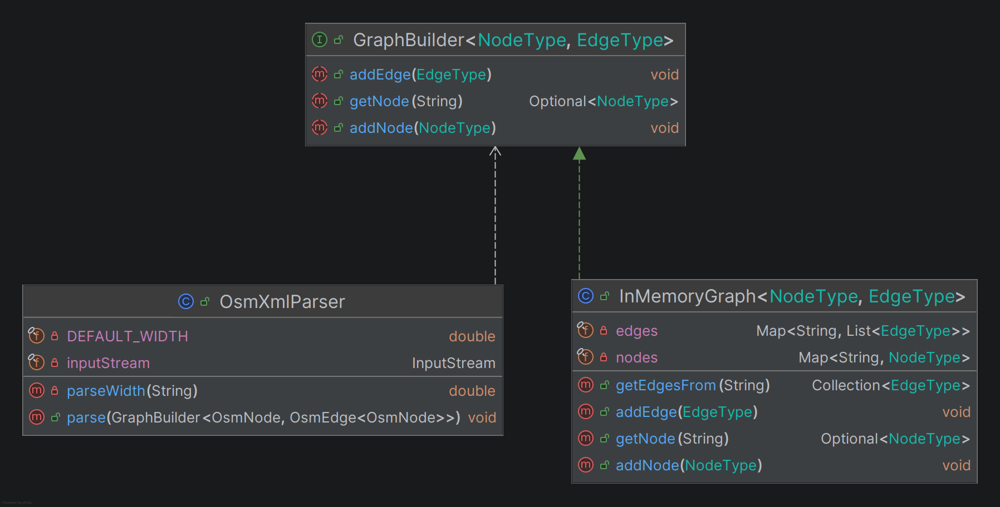
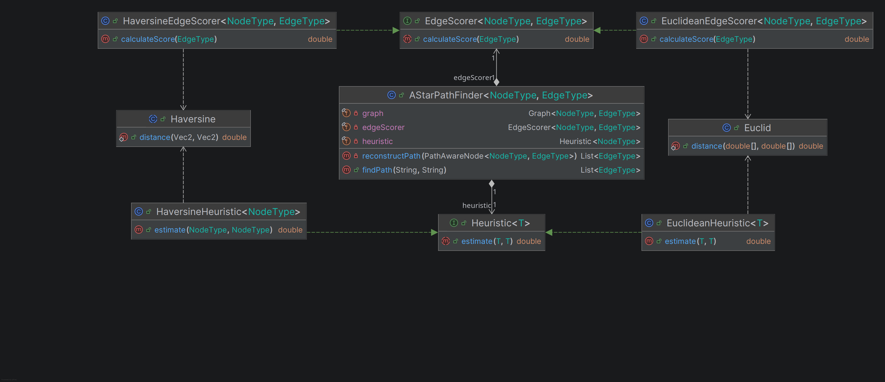

# Kapitel 8: Entwurfsmuster

<!--[2 unterschiedliche Entwurfsmuster aus der Vorlesung (oder nach Absprache auch andere) jeweils sinnvoll einsetzen, begründen und UML-Diagramm]-->

## Entwurfsmuster: Erbauer
<!--[Beschreibung, Begründung und UML-Diagramm]-->

### Beschreibung

Das Erbauer-Muster gehört zur Kategorie der Erzeugungsmuster.
Es trennt den Konstruktionsprozess eines komplexen Objekts systematisch von seiner finalen Repräsentation.
Dadurch wird es möglich, denselben algorithmischen Erstellungsprozess zu nutzen, um grundlegend unterschiedliche Ausprägungen oder Repräsentationen eines Objekts zu erzeugen. 
Das Muster besteht typischerweise aus einem Director, der den Ablauf des Zusammenbaus steuert, einem abstrakten Builder als Schnittstelle für Konstruktionsschritte und einem ConcreteBuilder, der das Produkt intern zusammenfügt.

### Begründung des Einsatzes im Projekt

Beim Einlesen und Verarbeiten von OpenStreetMap-Kartendaten (XML-Strukturen) ist der Konstruktionsprozess des Navigationsnetzwerks hochgradig schrittweise und komplex. Der Graph muss inkrementell – Knoten für Knoten und Kante für Kante unter Berücksichtigung von Metadaten wie Straßenbreiten – aufgebaut werden.

Zur sauberen Entkopplung wird dieses Muster im Projekt wie folgt angewandt:

* **Director:** Die Klasse `OsmXmlParser` fungiert als Director. Sie kennt die Logik des XML-Parsings und extrahiert sequenziell die Geodaten, besitzt aber keinerlei Wissen darüber, *wie* diese Daten im Speicher abgelegt oder vernetzt werden.
* **Builder-Interface:** Die Schnittstelle `GraphBuilder<NodeType extends Node, EdgeType extends Edge<? extends NodeType>>` definiert die abstrakten Erstellungsschritte `addNode()` und `addEdge()`.
* **ConcreteBuilder:** Die Klasse `InMemoryGraph` implementiert dieses Interface. Sie nimmt die Befehle des Parsers entgegen und baut intern die Datenstrukturen bestehend aus `HashMaps`, sowie `ArrayLists` für die Kantenbeziehungen auf.

**Sinnhaftigkeit:** Durch diese Trennung ist der Parser vollständig von der konkreten Speicherstruktur des Graphen entkoppelt. Sollten die Daten in Zukunft anstatt in einer In-Memoty Implementierung, in einer persistenten Graphendatenbank abgelegt werden, muss lediglich ein neuer *ConcreteBuilder* implementiert werden. Der XML-Parsing-Algorithmus im `OsmXmlParser` bleibt dabei völlig unverändert.

## Entwurfsmuster: Strategie
<!--[Beschreibung, Begründung und UML-Diagramm]-->

### Beschreibung

Das Strategie-Muster ist ein Verhaltensmuster, welches eine Familie von Algorithmen definiert, diese jeweils in einer eigenen Klasse kapselt und sie über ein gemeinsames Interface vollständig austauschbar macht.
Das Muster ermöglicht es, den konkreten Algorithmus dynamisch zur Laufzeit zu wechseln, unabhängig von den Clients, die ihn aufrufen.
Es verhindert dadurch starre, schwer erweiterbare Verzweigungen innerhalb der zentralen Kontrolllogik.

### Begründung des Einsatzes im Projekt

Der Routing-Algorithmus `AStarPathFinder` benötigt zur Ermittlung des optimalen Pfades zwei mathematische Bewertungsfunktionen: Erstens die Berechnung der tatsächlichen Bewegungskosten einer Kante (`edgeScorer`) und zweitens eine Heuristik zur Schätzung der verbleibenden Restdistanz zum Zielknoten (`heuristic`).

Anstatt mathematische Formeln fest in den A*-Suchalgorithmus einzubauen, wurde das Strategie-Muster verwendet:

* **Context:** Der `AStarPathFinder` agiert als Kontext. Er steuert die Such-Warteschlange (`PriorityQueue`), delegiert die Kostenberechnungen jedoch vollständig an die Strategien.
* **Strategy-Interface:** Das funktionale Interface `EdgeScorer<NodeType, EdgeType extends Edge<? extends NodeType>>` und `Heuristic<T extends Node>` dient als gemeinsame Abstraktion für die Kostenberechnungen.
* **Concrete Strategies:**
1. `HaversineEdgeScorer` und `HaversineHeuristic`: Berechnen die exakte Distanz zwischen zwei geografischen Koordinaten unter Berücksichtigung der Erdkrümmung Großkreisdistanz. Sie wird im echten Applikations- und Serverbetrieb verwendet.
2. `EuclideanEdgeScorer` und `EuclideanHeuristic`: Berechnen den einfachen euklidischen Abstand im flachen, zweidimensionalen Koordinatenraum. Sie wird in den isolierten Unit-Tests eingesetzt.

**Sinnhaftigkeit:** Dank des Strategie-Musters bleibt der Kern-Routing-Algorithmus mathematisch völlig neutral.
Er weiß, dass er Kosten bewerten muss, kennt aber nicht die zugrundeliegende Implementierung. Dies bringt den enormen Vorteil mit sich, dass der Pfadfinder im Test-Modul mit einfachen flachen Vektoren (`Vector2Node`) validiert werden kann, während er im Produktivcode ohne Codeänderungen mit geographischen Koordinaten arbeitet. Auch zukünftige Erweiterungen, wie etwa ein Scorer, der eine Straßenüberquerung mit einer höheren Gehzeit gewichtet, lassen sich als neue Strategie ohne Modifikation des `AStarPathFinder` integrieren.

